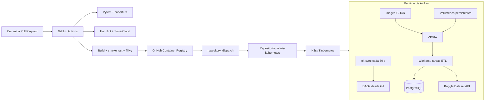
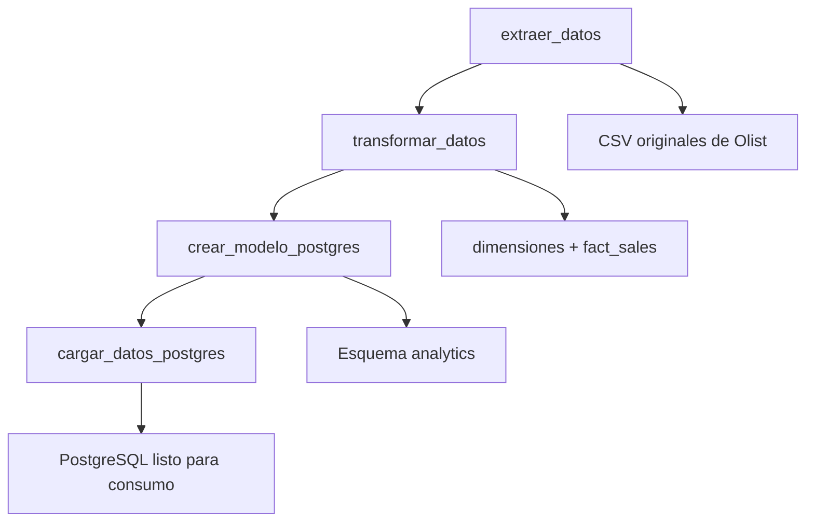

# POLARIS Airflow


Repositorio de **aplicación, imagen y lógica ETL** de la plataforma de datos **POLARIS Logistics**. Este proyecto construye una imagen personalizada de Apache Airflow, incorpora las dependencias y módulos necesarios para procesar el dataset de comercio electrónico de Olist, publica la imagen en GitHub Container Registry y notifica al repositorio de Kubernetes para iniciar el despliegue.

El repositorio está diseñado como una pieza de portafolio para demostrar prácticas de **ingeniería de datos y DevSecOps**: separación de responsabilidades, pipelines reproducibles, pruebas automatizadas, análisis de calidad, escaneo de vulnerabilidades, imágenes ejecutadas sin root, versionado por commit y despliegue desacoplado de los DAGs.

> **Alcance:** este repositorio no aprovisiona AWS ni administra directamente el clúster Kubernetes. Produce el artefacto de aplicación y dispara el despliegue en el repositorio de plataforma.

## Índice

- [Contexto de la plataforma](#contexto-de-la-plataforma)
- [Responsabilidad de este repositorio](#responsabilidad-de-este-repositorio)
- [Arquitectura de la solución](#arquitectura-de-la-solución)
- [Flujo de entrega](#flujo-de-entrega)
- [Pipeline de datos](#pipeline-de-datos)
- [Modelo analítico](#modelo-analítico)
- [Seguridad y DevSecOps](#seguridad-y-devsecops)
- [Estructura del repositorio](#estructura-del-repositorio)
- [Requisitos](#requisitos)
- [Configuración](#configuración)
- [Ejecución local](#ejecución-local)
- [Pruebas](#pruebas)
- [CI/CD](#cicd)
- [Operación en Kubernetes](#operación-en-kubernetes)
- [Limitaciones conocidas](#limitaciones-conocidas)
- [Repositorios relacionados](#repositorios-relacionados)
- [Licencia](#licencia)

## Contexto de la plataforma

POLARIS Logistics representa una plataforma ETL para procesar el **Brazilian E-Commerce Public Dataset by Olist**. El objetivo es extraer pedidos, clientes, productos, vendedores, pagos y reseñas; transformarlos en un modelo analítico; y dejarlos disponibles en PostgreSQL para consultas y visualización.

La solución está dividida en tres capas para que cada repositorio tenga una responsabilidad clara:

| Capa | Responsabilidad | Repositorio |
| --- | --- | --- |
| Infraestructura | Red AWS, instancias EC2, IAM, almacenamiento y estado de Terraform | Repositorio de infraestructura |
| Plataforma | K3s/Kubernetes, Helm, networking, persistencia, secretos y observabilidad | Repositorio de Kubernetes |
| Aplicación de datos | Imagen Airflow, DAGs, extracción, transformación, carga y pruebas | **Este repositorio** |

La visión de infraestructura y el diseño del clúster se conservan en [inflaestrutura.md](inflaestrutura.md) y [kubernetes.md](kubernetes.md). Esos documentos describen las capas externas que consumen el artefacto producido aquí.

## Responsabilidad de este repositorio

Este repositorio concentra cuatro responsabilidades:

1. **Empaquetar la aplicación:** construir una imagen basada en `apache/airflow:3.2.2` con las dependencias Python, el código ETL y el SQL del modelo.
2. **Definir la orquestación:** mantener el DAG `olist_etl_pipeline` y su secuencia de extracción, transformación, modelado y carga.
3. **Validar el cambio:** ejecutar pruebas dinámicas, cobertura, Hadolint, smoke tests de la imagen, Trivy y SonarCloud.
4. **Entregar el artefacto:** publicar la imagen en GHCR con el SHA del commit y `latest`, y disparar un evento en el repositorio `polaris-kubernetes`.

Los DAGs no se empaquetan dentro de la imagen. Kubernetes los obtiene desde Git mediante `git-sync`, con una sincronización configurada en la plataforma externa. Esto permite actualizar la definición de los workflows de forma independiente de la imagen de runtime.

## Arquitectura de la solución



El flujo de despliegue es intencionalmente desacoplado:

- **La imagen** contiene el runtime y el código estable de soporte: dependencias, módulos ETL y SQL.
- **Los DAGs** se montan desde un volumen gestionado por `git-sync`, por lo que no dependen de una reconstrucción de imagen para cada cambio de orquestación.
- **Los datos temporales y procesados** se escriben en volúmenes montados por Kubernetes, no en el filesystem efímero del contenedor.
- **La infraestructura y el clúster** se gestionan en repositorios separados, con sus propios controles y ciclos de vida.

## Flujo de entrega

En cada cambio relevante, GitHub Actions ejecuta la siguiente cadena:

```text
Checkout
	-> Hadolint
	-> Pytest + cobertura
	-> Build de imagen
	-> Smoke test de Airflow e imports
	-> Trivy sobre la imagen
	-> SonarCloud
	-> Publicación en GHCR [solo push a main]
	-> repository_dispatch a polaris-kubernetes
```

En `main`, la imagen se publica con dos tags:

- `ghcr.io/lopezzuluagaj3-collab/polaris-airflow:<commit-sha>` para despliegues reproducibles.
- `ghcr.io/lopezzuluagaj3-collab/polaris-airflow:latest` como referencia conveniente para desarrollo.

El evento `deploy-airflow` incluye el SHA exacto de la imagen. El repositorio Kubernetes utiliza ese tag para descargar la versión aprobada por CI y ejecutar su workflow de despliegue.

## Pipeline de datos

El DAG `olist_etl_pipeline` define una ejecución manual (`schedule=None`) y evita ejecuciones históricas con `catchup=False`. La secuencia es lineal para garantizar que cada etapa consuma el resultado completo de la anterior:



### 1. Extracción

`etl/extract/kaggle_downloader.py` descarga `olistbr/brazilian-ecommerce` mediante la CLI de Kaggle. Antes de descargar, comprueba si los archivos requeridos ya existen en el directorio de datos; así evita trabajo y tráfico innecesario.

### 2. Transformación

`etl/transform/clean_orders.py`:

- convierte fechas a tipos temporales;
- deriva macro-regiones brasileñas para clientes y vendedores;
- construye las dimensiones de clientes, productos, vendedores y fechas;
- agrega pagos y reseñas por pedido antes de unirlos;
- construye `fact_sales` con granularidad `order_id + order_item_id`;
- valida que la cantidad de filas de la tabla de hechos conserve el número de líneas de pedido;
- escribe cinco CSV en `data/processed/`.

La agregación previa de pagos y reseñas evita multiplicar filas cuando un pedido tiene varias transacciones o reseñas.

### 3. Modelado y carga

`sql/create_star_schema.sql` crea el esquema `analytics`, sus restricciones, índices y vistas. `etl/load/postgres_loader.py`:

- crea el modelo solo si no está completo;
- carga los CSV en lotes de 2.000 filas por defecto;
- usa `ON CONFLICT DO NOTHING` para permitir cargas idempotentes;
- confirma toda la operación dentro de una transacción;
- ejecuta `rollback` ante errores.

## Modelo analítico

El modelo estrella contiene:

| Objeto | Tipo | Propósito |
| --- | --- | --- |
| `analytics.dim_customer` | Dimensión | Clientes y macro-región |
| `analytics.dim_product` | Dimensión | Productos y categorías traducidas |
| `analytics.dim_seller` | Dimensión | Vendedores y macro-región |
| `analytics.dim_date` | Dimensión | Calendario derivado de fechas de pedidos |
| `analytics.fact_sales` | Hechos | Líneas de venta, logística, pagos y reseñas |
| `analytics.v_order_metrics` | Vista | Métricas agregadas a nivel de pedido |
| `analytics.v_sales_by_date_category` | Vista | Ventas por fecha y categoría para consumo analítico |

Las claves foráneas, checks de valores no negativos e índices principales se definen en [sql/create_star_schema.sql](sql/create_star_schema.sql).

## Seguridad y DevSecOps

La seguridad se integra al ciclo de entrega:

- **Dependencias y secretos:** las credenciales de Kaggle y PostgreSQL se reciben por variables de entorno o Secrets de Kubernetes; `.env` está excluido de Git.
- **Imagen mínima de aplicación:** el `Dockerfile` instala dependencias sin cache y cambia a UID `50000` después de las operaciones de instalación.
- **Hadolint:** revisa prácticas inseguras o problemáticas del `Dockerfile`.
- **Trivy:** escanea la imagen construida y bloquea vulnerabilidades `CRITICAL` y `HIGH`, ignorando únicamente vulnerabilidades documentadas en [.trivyignore](.trivyignore).
- **SonarCloud:** analiza el código ETL y recibe el reporte de cobertura generado por pytest.
- **Acciones fijadas:** las acciones de GitHub Actions se referencian por SHA para reducir el riesgo de cambios inesperados en dependencias de CI.
- **SQL parametrizado:** la carga utiliza `psycopg2.sql` para identificadores y `execute_values` para insertar valores por lotes.
- **Transacciones:** el modelo y la carga se confirman de forma atómica, con rollback cuando una etapa falla.
- **Trazabilidad:** el tag basado en SHA permite vincular una imagen publicada con un commit y un resultado concreto de CI.

Las excepciones de Trivy no deben interpretarse como vulnerabilidades resueltas. Están asociadas principalmente a la imagen base y deben revisarse cuando se actualicen Airflow, Debian o los proveedores instalados.

## Estructura del repositorio

```text
.
├── .github/workflows/deploy.yml  # CI/CD, calidad, seguridad y publicación
├── dags/
│   └── pipeline_etl.py            # DAG de Airflow
├── etl/
│   ├── extract/                   # Descarga desde Kaggle
│   ├── transform/                # Limpieza y modelo dimensional
│   └── load/                     # Carga transaccional a PostgreSQL
├── sql/
│   └── create_star_schema.sql     # Tablas, restricciones, índices y vistas
├── tests/                         # Pruebas unitarias e integración local
├── data/                          # Punto de montaje para datos; no contiene dataset
├── docs/eda.ipynb                 # Exploración del dataset
├── Dockerfile                     # Imagen personalizada de Airflow
├── requirements.txt               # Dependencias de runtime
├── TESTING.md                     # Diseño y convenciones de pruebas
├── inflaestrutura.md              # Contexto de la capa de infraestructura
├── kubernetes.md                  # Contexto de la capa de plataforma
└── README.md                      # Documentación de este repositorio
```

## Requisitos

Para desarrollo local:

- Python 3.12.
- Docker.
- Git.
- Una instancia PostgreSQL si se desea ejecutar la carga real.
- Un token de Kaggle si se desea descargar el dataset.

Para el despliegue completo, además se requiere el entorno Kubernetes descrito en [kubernetes.md](kubernetes.md), acceso al repositorio `polaris-kubernetes`, permisos para publicar en GHCR y los secretos de GitHub Actions configurados.

## Configuración

Nunca se deben confirmar credenciales en el repositorio. Las variables soportadas son:

| Variable | Uso | Requerida |
| --- | --- | --- |
| `KAGGLE_API_TOKEN` | Autenticación de descarga del dataset | Para extracción |
| `AIRFLOW_PROJECT_ROOT` | Raíz del proyecto utilizada por el DAG | Opcional |
| `ETL_DATA_DIR` | Directorio predeterminado del extractor | Opcional |
| `DATABASE_URL` o `POSTGRES_URL` | URL completa de PostgreSQL | Alternativa |
| `ETL_POSTGRES_HOST` | Host de PostgreSQL específico del ETL | Alternativa |
| `ETL_POSTGRES_PORT` | Puerto de PostgreSQL específico del ETL | Opcional |
| `ETL_POSTGRES_DB` | Base de datos específica del ETL | Alternativa |
| `ETL_POSTGRES_USER` | Usuario específico del ETL | Alternativa |
| `ETL_POSTGRES_PASSWORD` | Contraseña específica del ETL | Alternativa |
| `POSTGRES_HOST`, `POSTGRES_PORT`, `POSTGRES_DB`, `POSTGRES_USER`, `POSTGRES_PASSWORD` | Configuración PostgreSQL estándar | Alternativa |

Las variables `ETL_POSTGRES_*` tienen prioridad sobre sus equivalentes `POSTGRES_*`. Para una ejecución local se puede usar un archivo `.env` sin versionarlo.

## Ejecución local

### Instalar dependencias

```bash
python -m venv .venv
# Linux/macOS
source .venv/bin/activate
# Windows PowerShell
# .\.venv\Scripts\Activate.ps1

python -m pip install --upgrade pip
pip install -r requirements.txt
pip install pytest pytest-cov
```

### Ejecutar la transformación

Con los CSV originales en `data/`:

```bash
python -m etl.transform.clean_orders
```

También se pueden indicar rutas dentro de la raíz del proyecto:

```bash
python -m etl.transform.clean_orders \
	--data-dir data \
	--output-dir data/processed
```

### Crear y cargar PostgreSQL

Configure las variables de conexión y ejecute:

```bash
python -m etl.load.load_to_postgres \
	--processed-dir data/processed \
	--models-sql sql/create_star_schema.sql
```

La carga es idempotente para las claves existentes y utiliza transacciones para evitar estados parciales.

### Construir y probar la imagen

```bash
docker build -t polaris-airflow:local .
docker run --rm polaris-airflow:local airflow version
docker run --rm polaris-airflow:local \
	python -c "import pandas, psycopg2; print('Importaciones críticas OK')"
```

Los DAGs se entregan a Airflow mediante `git-sync` en Kubernetes; por eso no se espera que `dags/` esté dentro de la imagen construida por este Dockerfile.

## Pruebas

Las pruebas son dinámicas y ejecutan la lógica real de extracción, transformación y carga con fixtures temporales y mocks para dependencias externas:

```bash
python -m pytest tests/ -v
```

Para reproducir el comando de CI con cobertura:

```bash
python -m pytest tests/ \
	--cov=etl \
	--cov-report=xml:coverage.xml \
	-v --tb=short --maxfail=1
```

La suite cubre:

- descarga condicional del dataset;
- parsing de fechas y construcción de dimensiones;
- preservación del grano de `fact_sales`;
- agregación de pagos y reseñas;
- validación de columnas y rutas;
- creación transaccional del modelo;
- cargas por lotes, idempotencia y rollback;
- validaciones del CLI.

El detalle de fixtures y patrones de mocking está en [TESTING.md](TESTING.md).

## CI/CD

El workflow [.github/workflows/deploy.yml](.github/workflows/deploy.yml) se activa en Pull Requests y en cambios a `main` que afectan la aplicación, sus dependencias, pruebas, Dockerfile o el workflow.

Los secretos principales del workflow son:

| Secreto | Uso |
| --- | --- |
| `GHCR_TOKEN` | Publicar la imagen en GitHub Container Registry |
| `CROSS_REPO_TOKEN` | Disparar el despliegue en `polaris-kubernetes` |
| `SONAR_TOKEN` | Análisis SonarCloud |
| `SMTP_USERNAME`, `SMTP_PASSWORD`, `NOTIFY_EMAIL` | Notificación del resultado de CI |

El job de publicación solo corre después de que Trivy finaliza correctamente y únicamente para un push a `main`. El workflow envía una notificación con el estado de las pruebas, el análisis y el escaneo.

## Operación en Kubernetes

El repositorio de plataforma consume la imagen publicada y configura el runtime de Airflow. La integración esperada es:

1. El repositorio Kubernetes recibe `deploy-airflow` con `image_tag` igual al SHA del commit.
2. Helm actualiza el workload para usar esa imagen.
3. Kubernetes monta los volúmenes personalizados para datos, resultados y configuración persistente.
4. `git-sync` clona el repositorio de DAGs y sincroniza cambios aproximadamente cada 30 segundos.
5. Airflow carga los DAGs desde el volumen sincronizado y ejecuta las tareas en los workers configurados.
6. Las tareas escriben los CSV intermedios en el volumen de datos y cargan el resultado en PostgreSQL.

La configuración exacta de Helm, Secrets, PVCs, ingress, Airflow Executor y observabilidad pertenece a [kubernetes.md](kubernetes.md) y al repositorio de plataforma. Este README documenta el contrato entre ambos repositorios: imagen versionada por SHA, evento `deploy-airflow` y código de DAG disponible mediante `git-sync`.

## Limitaciones conocidas

- El DAG está configurado con `schedule=None`; la ejecución programada debe definirse en la capa de orquestación o cambiarse explícitamente en el DAG.
- `postgres_loader.py` conserva un valor por defecto histórico para `sql/models.sql`; en el DAG se utiliza explícitamente `sql/create_star_schema.sql`. Para el CLI se recomienda pasar siempre `--models-sql sql/create_star_schema.sql`.
- La imagen no contiene `dags/` ni el dataset. Ambos dependen de los volúmenes y del mecanismo `git-sync` configurados en Kubernetes.
- La extracción valida nueve archivos esperados, mientras la transformación utiliza ocho tablas CSV; el archivo de geolocalización se conserva como insumo esperado, pero no participa todavía en el modelo analítico.
- La cobertura actual es principalmente unitaria y de integración local. No reemplaza pruebas contra un PostgreSQL real, un clúster Kubernetes ni un despliegue completo de Airflow.
- Las excepciones de `.trivyignore` requieren revisión periódica al actualizar la imagen base y las dependencias.

Estas limitaciones están documentadas para hacer visibles las decisiones pendientes y evitar presentar el proyecto como una plataforma productiva completamente gestionada.

## Repositorios relacionados

- **Infraestructura:** aprovisiona AWS con Terraform y prepara los hosts para el clúster. Contexto disponible en [inflaestrutura.md](inflaestrutura.md).
- **Plataforma Kubernetes:** despliega K3s/Kubernetes, Helm, Airflow, almacenamiento, networking, secretos y observabilidad. Contexto disponible en [kubernetes.md](kubernetes.md).
- **Aplicación Airflow:** este repositorio; contiene el Dockerfile, dependencias, DAG, ETL, SQL y pruebas.

## Licencia

Proyecto de portafolio personal. Apache Airflow, las dependencias Python, la imagen base y el dataset de Olist mantienen sus respectivas licencias y condiciones de uso.